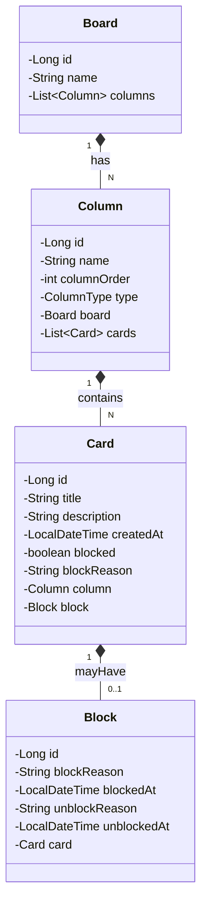

# Projeto-Gerenciamento_de_tarefas

## Descrição
Este projeto é um sistema de gerenciamento de tarefas (task board) que permite criar boards, colunas e cards para organizar tarefas. Ele foi desenvolvido usando Spring Boot e MySQL.

## Diagrama de Classes (Domínio da API)

